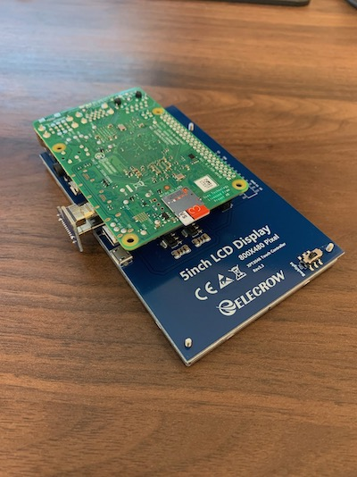
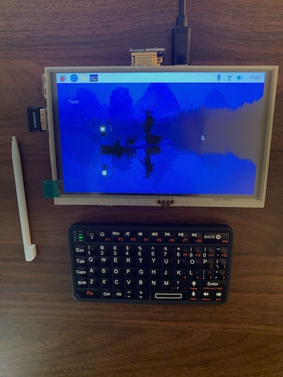
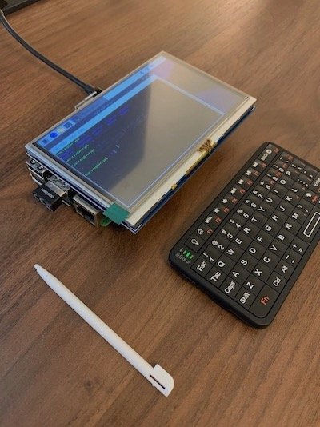

# LizardBolt


The LizardBolt is a cell phone made from a Raspberry Pi.

I have organized this repository as a minimal guide for reproducing the work.

## Parts

* [Raspberry Pi 4B](https://www.raspberrypi.com/products/raspberry-pi-4-model-b/)
* [Elecrow 5 inch Raspberry Pi touch display](https://www.elecrow.com/hdmi-5-inch-800x480-tft-display-for-raspberry-pi-b-p-1384.html)
* [Rii Mini Bluetooth Keyboard](http://www.riitek.com/product/259.html)
* [SIM800C USB to GSM Module](https://www.amazon.com/dp/B0B64X81LD?psc=1&ref=ppx_yo2ov_dt_b_product_details)

## Assembly

### OS image

1. Use the [Raspberry Pi Imager](https://www.raspberrypi.com/software/) to install a clean OS image on your SD card. I used 64 bit Raspbian.
2. Attach an HDMI monitor (not the 5 inch display since that will take some configuration), mouse, and keyboard to the Pi, turn it on, and follow the initial setup instructions.
3. Pair the Bluetooth keyboard with the Pi. You can do this step at any time, whenever you're ready to stop using your USB keyboard.

### Display

You can perform these steps with the HDMI monitor still connected, or via SSH.

1. On the Pi, open a terminal and navigate to your home directory.
2. Run the following. You can look on the GitHub page to see what the script does. Basically it just adds configuration for the screen size and other details in `/boot/firmware/config.txt`. It also installs software that allows the touchscreen to work. The `LCD5-show` script is for the 5 inch screens, so if you bought a different size screen from the same manufacturer, you can run one of the other scripts.
```shell
git clone https://github.com/goodtft/LCD-show.git
chmod -R 755 LCD-show
cd LCD-show/
sudo ./LCD5-show
```
3. Attach the display to the Pi by plugging in the GPIO pins and the HDMI connector that comes with the display. There is only one way to plug in the display so that the HDMI connector lines up correctly, so this step should hopefully be intuitive.
4. Restart the Pi. The display should turn on and show the desktop screen. The touchscreen should work.





### Battery

TODO

### Microphone

TODO

### Cellular

TODO

### Case and form factor

TODO

## References

* [PiPhone](https://github.com/climberhunt/PiPhone)

